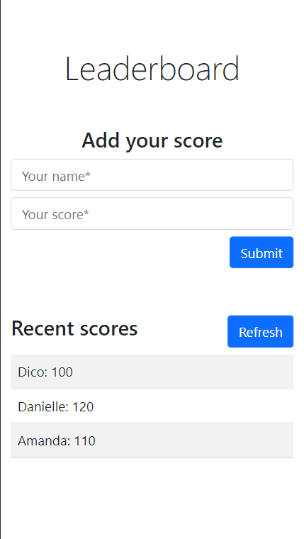

# Leaderboard

> The leaderboard website displays scores submitted by different players. It also allows you to submit your score. All data is preserved thanks to the external [Leaderboard API service](https://www.notion.so/microverse/Leaderboard-API-service-24c0c3c116974ac49488d4eb0267ade3). This project is built using HTML, Boostrap, JavaScript and Webpack.

## Mobile

## Desktop

## Built With

- HTML
- Bootsrap
- JavaScript
- Webpack
- VSCode
- Gitflow & GitHub

## Live Demo

[Live Demo Link](http://dicodiaz.me/leaderboard/dist/)

## Getting Started

To get this project up and running, follow these simple steps:

1. Clone the repository into your machine.
2. Open the project's folder with your preferred source-code editor.
3. Run `npm install`.
4. Run `npm start`.

### Prerequisites

- Any modern web browser.
- Any source-code editor (VSCode recommended).

### Setup

Follow the steps described before.

## Authors

👤 **Dico Diaz Dussan**

- GitHub: [@dicodiaz](https://github.com/dicodiaz)
- LinkedIn: [Dico Diaz Dussan](https://www.linkedin.com/in/dico-diaz-dussan/)
- Portfolio: [dicodiaz.com.co](https://dicodiaz.com.co)

## 🤝 Contributing

Contributions, issues, and feature requests are welcome!

Feel free to check the [issues page](../../issues/).

## Show your support

Give a ⭐️ if you like this project!

## Acknowledgments

- Hat tip to anyone whose code was used
- Inspiration
- Microverse program
- My code reviewers

## 📝 License

This project is [MIT](./MIT.md) licensed.
